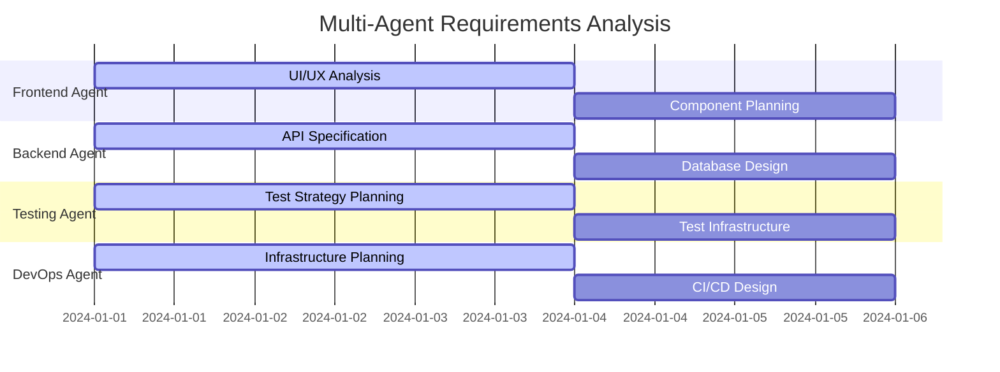
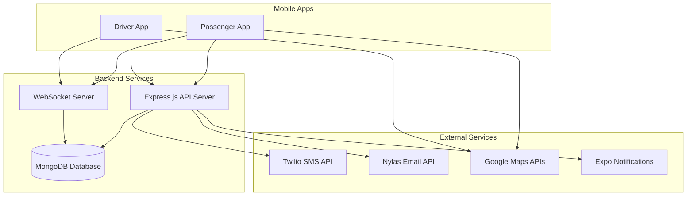
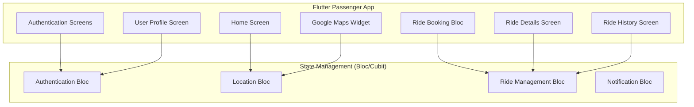
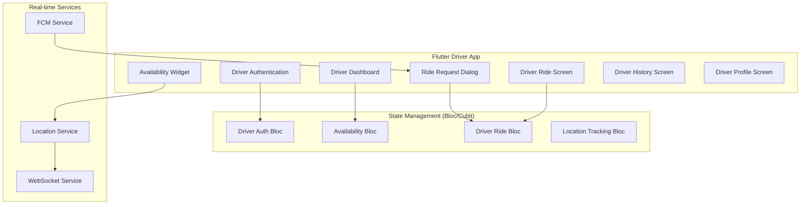
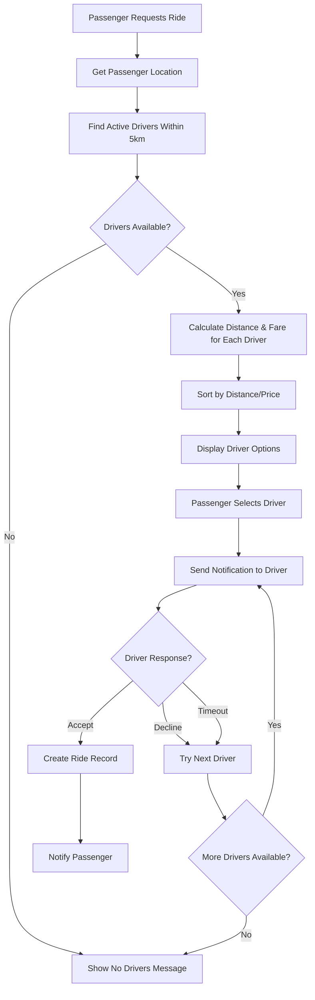
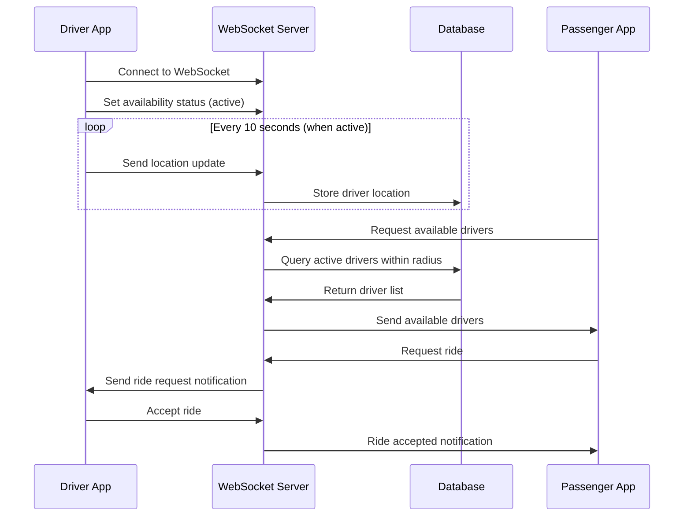
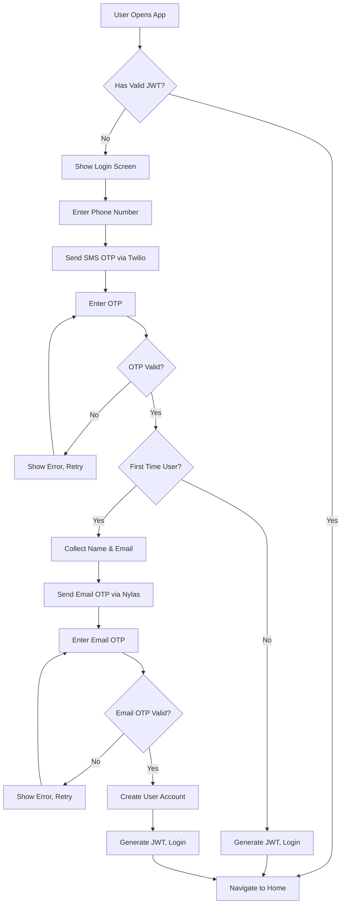
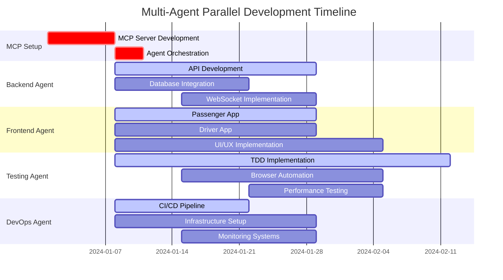

# RideWith - Full-Stack Ride Booking App Design

## Multi-Agent Development Architecture

### Agent Specialization Framework

#### **Orchestrator Agent**
- **Primary Role**: Coordinate all development agents and manage task distribution
- **Responsibilities**: 
  - Parse requirements and distribute tasks to specialized agents
  - Manage parallel execution and dependency resolution
  - Integrate outputs from all agents into cohesive implementation
  - Monitor progress and resolve conflicts between agents
- **Tools**: Task scheduling, dependency management, integration oversight

#### **Flutter Frontend Agent**
- **Primary Role**: Flutter mobile app development for both passenger and driver apps
- **Responsibilities**:
  - UI/UX implementation with Flutter widgets
  - State management with Bloc/Cubit patterns
  - Platform-specific optimizations (iOS/Android)
  - Integration with external services (Maps, FCM)
- **Parallel Tasks**: Can work on passenger and driver apps simultaneously
- **MCP Integration**: Uses MCP servers for code generation and testing

#### **Backend API Agent**
- **Primary Role**: Node.js backend development and API implementation
- **Responsibilities**:
  - REST API endpoints development
  - Database schema and operations
  - Authentication and security implementation
  - WebSocket server for real-time communication
- **Parallel Tasks**: Can develop multiple API modules concurrently
- **MCP Integration**: Automated API testing and documentation generation

#### **Real-time Communication Agent**
- **Primary Role**: WebSocket and real-time feature implementation
- **Responsibilities**:
  - WebSocket server architecture
  - Real-time location tracking
  - Push notification system
  - Event-driven communication patterns
- **Parallel Tasks**: Works alongside backend agent for seamless integration
- **MCP Integration**: Real-time testing and monitoring

#### **Testing & QA Agent (TDD Specialist)**
- **Primary Role**: Comprehensive testing strategy with TDD approach
- **Responsibilities**:
  - TDD implementation (Red-Green-Refactor cycle)
  - Automated browser testing with Playwright-style automation
  - Integration and end-to-end testing
  - Performance and security testing
- **Parallel Tasks**: Tests multiple components simultaneously
- **MCP Integration**: Automated test generation and execution

#### **DevOps & Infrastructure Agent**
- **Primary Role**: Deployment, CI/CD, and infrastructure management
- **Responsibilities**:
  - CI/CD pipeline setup
  - Cloud infrastructure configuration
  - Monitoring and logging systems
  - Database deployment and management
- **Parallel Tasks**: Sets up infrastructure while development progresses
- **MCP Integration**: Infrastructure as code and automated deployments

### Multi-Agent Coordination Protocol

#### **Phase 1: Parallel Requirements Analysis (2-3 days)**


#### **Phase 2: Parallel Development Setup (1 week)**
- **Frontend Agent**: Flutter project setup, dependencies, and basic structure
- **Backend Agent**: Node.js project setup, database configuration, basic API structure
- **Testing Agent**: Test framework setup, TDD infrastructure, browser automation
- **DevOps Agent**: Repository setup, CI/CD pipeline, development environment
- **Real-time Agent**: WebSocket server setup, event system architecture

#### **Phase 3: Parallel Core Development (4-6 weeks)**
- **All agents work simultaneously on their respective domains**
- **Daily integration checkpoints managed by Orchestrator Agent**
- **Continuous testing by Testing Agent as features are developed**
- **Progressive deployment by DevOps Agent for testing environments**

## TDD Integration with Browser Automation

### TDD Framework Architecture

#### **Red Phase: Failing Tests First**
```dart
// Example TDD approach for Flutter
class RideBookingTDDFramework {
  // 1. Write failing test first
  testWidgets('should display available drivers when location is set', (tester) async {
    // Arrange
    final mockLocationBloc = MockLocationBloc();
    final mockRideBloc = MockRideBloc();
    
    // Act
    await tester.pumpWidget(
      MultiBlocProvider(
        providers: [
          BlocProvider<LocationBloc>.value(value: mockLocationBloc),
          BlocProvider<RideBloc>.value(value: mockRideBloc),
        ],
        child: RideBookingScreen(),
      ),
    );
    
    // Assert (This will fail initially)
    expect(find.byType(DriverListWidget), findsOneWidget);
    expect(find.byType(LoadingIndicator), findsNothing);
  });
}
```

#### **Green Phase: Minimal Implementation**
```dart
// Implement just enough to make test pass
class RideBookingScreen extends StatelessWidget {
  @override
  Widget build(BuildContext context) {
    return BlocBuilder<RideBloc, RideState>(
      builder: (context, state) {
        if (state.availableDrivers.isNotEmpty) {
          return DriverListWidget(drivers: state.availableDrivers);
        }
        return SizedBox.shrink(); // Minimal implementation
      },
    );
  }
}
```

#### **Refactor Phase: Improve Code Quality**
```dart
// Refactor with better error handling, loading states, etc.
class RideBookingScreen extends StatelessWidget {
  @override
  Widget build(BuildContext context) {
    return BlocBuilder<RideBloc, RideState>(
      builder: (context, state) {
        return switch (state.status) {
          RideStatus.loading => const LoadingIndicator(),
          RideStatus.loaded when state.availableDrivers.isNotEmpty => 
            DriverListWidget(drivers: state.availableDrivers),
          RideStatus.loaded => const NoDriversAvailableWidget(),
          RideStatus.error => ErrorWidget(state.errorMessage),
          _ => const SizedBox.shrink(),
        };
      },
    );
  }
}
```

### Browser Automation Framework (Playwright-style)

#### **Web-based Testing Interface**
```typescript
// MCP Server for Browser Automation
class RideWaveBrowserAutomation {
  private playwright: PlaywrightBrowser;
  
  async setupTestEnvironment() {
    // Launch browser with specific configuration
    this.playwright = await chromium.launch({
      headless: false, // For debugging
      slowMo: 1000,   // Slow down for observation
    });
  }
  
  async testPassengerBookingFlow() {
    const page = await this.playwright.newPage();
    
    // Test complete passenger flow
    await this.testPhoneAuthentication(page);
    await this.testLocationPermissions(page);
    await this.testDestinationSelection(page);
    await this.testDriverSelection(page);
    await this.testRideConfirmation(page);
  }
  
  async testPhoneAuthentication(page: Page) {
    // Navigate to authentication
    await page.goto('http://localhost:3000/auth');
    
    // Fill phone number
    await page.fill('[data-testid="phone-input"]', '+1234567890');
    await page.click('[data-testid="send-otp-button"]');
    
    // Wait for OTP screen
    await page.waitForSelector('[data-testid="otp-input"]');
    
    // Mock OTP verification
    await this.mockTwilioOTP(page, '1234');
    
    // Verify successful login
    await page.waitForSelector('[data-testid="home-screen"]');
  }
  
  async testLocationPermissions(page: Page) {
    // Mock geolocation
    await page.context().grantPermissions(['geolocation']);
    await page.setGeolocation({ latitude: 37.7749, longitude: -122.4194 });
    
    // Verify map loads with user location
    await page.waitForSelector('[data-testid="google-map"]');
    await page.waitForSelector('[data-testid="user-location-marker"]');
  }
}
```

#### **Flutter Integration Testing with Browser Control**
```dart
// Integration test with browser automation
class IntegrationTestSuite {
  late FlutterDriver driver;
  late BrowserAutomation browser;
  
  @override
  Future<void> setUpAll() async {
    driver = await FlutterDriver.connect();
    browser = BrowserAutomation();
    await browser.setupTestEnvironment();
  }
  
  Future<void> testCompleteRideBookingFlow() async {
    // Start Flutter app
    await driver.tap(find.byValueKey('start-ride-booking'));
    
    // Use browser automation to simulate driver acceptance
    await browser.simulateDriverAcceptance();
    
    // Verify in Flutter app
    await driver.waitFor(find.byValueKey('ride-accepted-notification'));
    
    // Continue with ride simulation
    await browser.simulateDriverArrival();
    await driver.waitFor(find.byValueKey('driver-arrived-notification'));
  }
}
```

## MCP Server Integration Architecture

### MCP Server Ecosystem

#### **Code Generation MCP Server**
```typescript
class CodeGenerationMCPServer implements MCPServer {
  name = "code-generation-server";
  version = "1.0.0";
  
  tools = [
    {
      name: "generate-flutter-widget",
      description: "Generate Flutter widget with TDD tests",
      inputSchema: {
        type: "object",
        properties: {
          widgetName: { type: "string" },
          widgetType: { type: "string" },
          requirements: { type: "string" },
          testRequirements: { type: "string" }
        }
      }
    },
    {
      name: "generate-api-endpoint",
      description: "Generate Node.js API endpoint with tests",
      inputSchema: {
        type: "object",
        properties: {
          endpointPath: { type: "string" },
          httpMethod: { type: "string" },
          requestSchema: { type: "object" },
          responseSchema: { type: "object" }
        }
      }
    }
  ];
  
  async handleToolCall(name: string, arguments_: any) {
    switch (name) {
      case "generate-flutter-widget":
        return await this.generateFlutterWidget(arguments_);
      case "generate-api-endpoint":
        return await this.generateAPIEndpoint(arguments_);
    }
  }
  
  private async generateFlutterWidget(args: any) {
    // Generate widget code with TDD tests
    const widgetCode = await this.generateWidgetImplementation(args);
    const testCode = await this.generateWidgetTests(args);
    
    return {
      widget: widgetCode,
      tests: testCode,
      dependencies: this.extractDependencies(widgetCode)
    };
  }
}
```

#### **Testing Automation MCP Server**
```typescript
class TestingAutomationMCPServer implements MCPServer {
  name = "testing-automation-server";
  version = "1.0.0";
  
  tools = [
    {
      name: "run-tdd-cycle",
      description: "Execute complete TDD Red-Green-Refactor cycle",
      inputSchema: {
        type: "object",
        properties: {
          testFile: { type: "string" },
          implementationFile: { type: "string" },
          requirements: { type: "string" }
        }
      }
    },
    {
      name: "browser-automation-test",
      description: "Run browser automation tests",
      inputSchema: {
        type: "object",
        properties: {
          testSuite: { type: "string" },
          browserConfig: { type: "object" },
          environment: { type: "string" }
        }
      }
    }
  ];
  
  async handleToolCall(name: string, arguments_: any) {
    switch (name) {
      case "run-tdd-cycle":
        return await this.executeTDDCycle(arguments_);
      case "browser-automation-test":
        return await this.runBrowserAutomation(arguments_);
    }
  }
  
  private async executeTDDCycle(args: any) {
    // Red Phase: Run failing tests
    const redResult = await this.runTests(args.testFile);
    
    if (redResult.allPassed) {
      throw new Error("Tests should fail in Red phase");
    }
    
    // Green Phase: Generate minimal implementation
    const implementation = await this.generateMinimalImplementation(args);
    await this.writeImplementation(args.implementationFile, implementation);
    
    const greenResult = await this.runTests(args.testFile);
    
    if (!greenResult.allPassed) {
      throw new Error("Tests should pass in Green phase");
    }
    
    // Refactor Phase: Improve code quality
    const refactoredCode = await this.refactorImplementation(args.implementationFile);
    await this.writeImplementation(args.implementationFile, refactoredCode);
    
    const refactorResult = await this.runTests(args.testFile);
    
    return {
      redPhase: redResult,
      greenPhase: greenResult,
      refactorPhase: refactorResult,
      finalImplementation: refactoredCode
    };
  }
}
```

#### **Infrastructure MCP Server**
```typescript
class InfrastructureMCPServer implements MCPServer {
  name = "infrastructure-server";
  version = "1.0.0";
  
  tools = [
    {
      name: "setup-ci-cd-pipeline",
      description: "Setup CI/CD pipeline with testing integration"
    },
    {
      name: "deploy-testing-environment",
      description: "Deploy isolated testing environment"
    },
    {
      name: "monitor-application-health",
      description: "Monitor application health and performance"
    }
  ];
  
  async handleToolCall(name: string, arguments_: any) {
    switch (name) {
      case "setup-ci-cd-pipeline":
        return await this.setupCICDPipeline(arguments_);
      case "deploy-testing-environment":
        return await this.deployTestingEnvironment(arguments_);
      case "monitor-application-health":
        return await this.monitorApplicationHealth(arguments_);
    }
  }
}
```

### MCP-Enabled Development Workflow

#### **Parallel Development with MCP Coordination**
```typescript
class MCPOrchestrator {
  private mcpServers: Map<string, MCPServer> = new Map();
  
  async initializeAgents() {
    // Initialize all MCP servers
    await this.connectMCPServer('code-generation', new CodeGenerationMCPServer());
    await this.connectMCPServer('testing', new TestingAutomationMCPServer());
    await this.connectMCPServer('infrastructure', new InfrastructureMCPServer());
    
    // Start parallel agent execution
    await this.startParallelAgents();
  }
  
  async startParallelAgents() {
    const tasks = [
      this.runFrontendAgent(),
      this.runBackendAgent(),
      this.runTestingAgent(),
      this.runDevOpsAgent()
    ];
    
    // Execute all agents in parallel
    await Promise.all(tasks);
  }
  
  async runFrontendAgent() {
    const codeGenServer = this.mcpServers.get('code-generation');
    const testingServer = this.mcpServers.get('testing');
    
    // Generate Flutter widgets with TDD
    const widgets = await codeGenServer.call('generate-flutter-widget', {
      widgetName: 'RideBookingScreen',
      widgetType: 'StatelessWidget',
      requirements: 'Display available drivers and allow selection'
    });
    
    // Run TDD cycle for each widget
    await testingServer.call('run-tdd-cycle', {
      testFile: 'test/widget/ride_booking_screen_test.dart',
      implementationFile: 'lib/screens/ride_booking_screen.dart',
      requirements: widgets.requirements
    });
  }
}
```

## Advanced TDD Integration Patterns

### TDD Results Processing with MCP
```dart
// Automated TDD phase detection and guidance
class TDDPhaseProcessor {
  static MCPServer testingServer;
  
  static Future<TDDPhaseResult> processTDDCycle(TestResults results) async {
    final phase = detectTDDPhase(results);
    
    switch (phase) {
      case TDDPhase.red:
        return await handleRedPhase(results);
      case TDDPhase.green:
        return await handleGreenPhase(results);
      case TDDPhase.refactor:
        return await handleRefactorPhase(results);
    }
  }
  
  static Future<TDDPhaseResult> handleRedPhase(TestResults results) async {
    // All tests should fail in red phase
    if (results.hasPassingTests) {
      return TDDPhaseResult.error('Some tests are passing in Red phase');
    }
    
    // Generate minimal implementation via MCP
    final implementation = await testingServer.call('generate-minimal-implementation', {
      'failingTests': results.failingTests,
      'requirements': results.requirements
    });
    
    return TDDPhaseResult.success(
      phase: TDDPhase.red,
      nextAction: 'Implement minimal code to pass tests',
      generatedCode: implementation
    );
  }
  
  static Future<TDDPhaseResult> handleGreenPhase(TestResults results) async {
    if (results.hasFailingTests) {
      return TDDPhaseResult.error('Tests still failing in Green phase');
    }
    
    // Analyze code quality for refactoring opportunities
    final refactorSuggestions = await testingServer.call('analyze-refactor-opportunities', {
      'codeFiles': results.implementationFiles,
      'testFiles': results.testFiles
    });
    
    return TDDPhaseResult.success(
      phase: TDDPhase.green,
      nextAction: 'Refactor code while keeping tests green',
      refactorSuggestions: refactorSuggestions
    );
  }
}
```

## Overview

RideWith is a real-time, full-stack car booking mobile application built using Flutter with a multi-agent development approach and comprehensive TDD integration. The system leverages MCP (Model Context Protocol) servers for automated development, testing, and deployment processes, enabling parallel development and rapid iteration cycles.

### Key Features
- Real-time ride booking and matching
- GPS-based location tracking and mapping
- SMS and email OTP authentication
- Push notifications for ride events
- Driver availability management
- Ride history and earnings tracking
- In-app communication between passengers and drivers

## Technology Stack & Dependencies

### Frontend (Mobile Applications)
- **Framework**: Flutter
- **Navigation**: Flutter Navigator 2.0 with GoRouter
- **State Management**: Bloc/Cubit or Provider
- **Maps**: Google Maps Flutter plugin
- **HTTP Client**: Dio or http package
- **Environment Variables**: flutter_dotenv
- **Local Storage**: SharedPreferences or Hive
- **Real-time Communication**: socket_io_client

### Backend
- **Runtime**: Node.js
- **Framework**: Express.js
- **Database**: MongoDB with Prisma ORM
- **Real-Time Communication**: Custom WebSocket Server
- **Authentication**: JWT (JSON Web Tokens)

### External Services
- **Phone Verification**: Twilio Verify API
- **Email Verification**: Nylas Email API
- **Maps & Location**: Google Maps APIs (Places, Directions, Maps SDK)
- **Push Notifications**: Firebase Cloud Messaging (FCM)
- **Distance Calculations**: Geolocator and custom calculations
- **Local Notifications**: flutter_local_notifications

## Architecture

### System Architecture Overview



### Component Architecture

#### Passenger App Architecture


#### Driver App Architecture


### Database Schema

#### User Collections
```typescript
// Users Collection
interface User {
  _id: ObjectId;
  name: string;
  phoneNumber: string;
  countryCode: string;
  email: string;
  isPhoneVerified: boolean;
  isEmailVerified: boolean;
  userType: 'passenger' | 'driver';
  createdAt: Date;
  updatedAt: Date;
}

// Driver Profiles Collection
interface DriverProfile {
  _id: ObjectId;
  userId: ObjectId;
  vehicleType: 'Car' | 'Motorcycle' | 'CNG';
  vehicleRegistrationNumber: string;
  registrationDate: Date;
  drivingLicenseNumber: string;
  vehicleColor: string;
  ratePerKilometer: number;
  isActive: boolean;
  currentLocation?: {
    latitude: number;
    longitude: number;
    timestamp: Date;
  };
  totalEarnings: number;
  completedRides: number;
  pendingRides: number;
  cancelledRides: number;
}

// Rides Collection
interface Ride {
  _id: ObjectId;
  passengerId: ObjectId;
  driverId?: ObjectId;
  pickupLocation: {
    latitude: number;
    longitude: number;
    address: string;
  };
  destination: {
    latitude: number;
    longitude: number;
    address: string;
  };
  distance: number;
  estimatedFare: number;
  status: 'requested' | 'accepted' | 'ongoing' | 'completed' | 'cancelled';
  requestedAt: Date;
  acceptedAt?: Date;
  pickedUpAt?: Date;
  completedAt?: Date;
  route?: any; // Google Maps route data
}
```

## API Endpoints Reference

### Authentication Endpoints
```typescript
// Phone verification
POST /api/auth/send-phone-otp
POST /api/auth/verify-phone-otp

// Email verification  
POST /api/auth/send-email-otp
POST /api/auth/verify-email-otp

// User registration
POST /api/auth/register
POST /api/auth/login

// Driver registration
POST /api/auth/driver/register
```

### Ride Management Endpoints
```typescript
// Passenger endpoints
GET /api/rides/available-drivers
POST /api/rides/request
GET /api/rides/history

// Driver endpoints
PUT /api/drivers/availability
GET /api/drivers/ride-requests
POST /api/drivers/accept-ride
POST /api/drivers/pickup-passenger
POST /api/drivers/complete-ride
GET /api/drivers/history
GET /api/drivers/stats
```

### User Profile Endpoints
```typescript
GET /api/users/profile
PUT /api/users/profile
POST /api/users/logout
```

## Business Logic Layer

### Ride Matching Algorithm



### Real-time Location Tracking



### Authentication Flow



## State Management

### Passenger App State Structure (Bloc/Cubit)
```dart
// Authentication State
class AuthState {
  final User? user;
  final String? token;
  final bool isAuthenticated;
  final AuthStatus status;
  
  const AuthState({
    this.user,
    this.token,
    this.isAuthenticated = false,
    this.status = AuthStatus.initial,
  });
}

// Location State
class LocationState {
  final Position? currentLocation;
  final PlaceDetails? destination;
  final bool isLocationPermissionGranted;
  final LocationStatus status;
  
  const LocationState({
    this.currentLocation,
    this.destination,
    this.isLocationPermissionGranted = false,
    this.status = LocationStatus.initial,
  });
}

// Ride State
class RideState {
  final Ride? currentRide;
  final List<Driver> availableDrivers;
  final List<Ride> rideHistory;
  final bool isLoading;
  final RideStatus status;
  
  const RideState({
    this.currentRide,
    this.availableDrivers = const [],
    this.rideHistory = const [],
    this.isLoading = false,
    this.status = RideStatus.initial,
  });
}
```

### Driver App State Structure (Bloc/Cubit)
```dart
// Driver Authentication State
class DriverAuthState {
  final Driver? driver;
  final String? token;
  final bool isAuthenticated;
  final AuthStatus status;
  
  const DriverAuthState({
    this.driver,
    this.token,
    this.isAuthenticated = false,
    this.status = AuthStatus.initial,
  });
}

// Driver Availability State
class AvailabilityState {
  final bool isActive;
  final Position? currentLocation;
  final AvailabilityStatus status;
  
  const AvailabilityState({
    this.isActive = false,
    this.currentLocation,
    this.status = AvailabilityStatus.offline,
  });
}

// Driver Ride State
class DriverRideState {
  final Ride? currentRide;
  final List<RideRequest> pendingRequests;
  final List<Ride> rideHistory;
  final DriverStatistics statistics;
  final RideStatus status;
  
  const DriverRideState({
    this.currentRide,
    this.pendingRequests = const [],
    this.rideHistory = const [],
    required this.statistics,
    this.status = RideStatus.initial,
  });
}
```

## Real-time Communication Architecture

### WebSocket Events

#### Driver Events
```dart
// Driver-to-Server Events
abstract class DriverSocketEvent {
  Map<String, dynamic> toJson();
}

class DriverConnectEvent extends DriverSocketEvent {
  final String driverId;
  final String token;
  
  DriverConnectEvent({required this.driverId, required this.token});
  
  @override
  Map<String, dynamic> toJson() => {
    'event': 'driver:connect',
    'data': {'driverId': driverId, 'token': token}
  };
}

class LocationUpdateEvent extends DriverSocketEvent {
  final double latitude;
  final double longitude;
  final DateTime timestamp;
  
  LocationUpdateEvent({
    required this.latitude,
    required this.longitude,
    required this.timestamp,
  });
  
  @override
  Map<String, dynamic> toJson() => {
    'event': 'driver:location-update',
    'data': {
      'latitude': latitude,
      'longitude': longitude,
      'timestamp': timestamp.toIso8601String(),
    }
  };
}

class AvailabilityChangeEvent extends DriverSocketEvent {
  final bool isActive;
  
  AvailabilityChangeEvent({required this.isActive});
  
  @override
  Map<String, dynamic> toJson() => {
    'event': 'driver:availability-change',
    'data': {'isActive': isActive}
  };
}

class RideResponseEvent extends DriverSocketEvent {
  final String rideId;
  final String response; // 'accept' or 'decline'
  
  RideResponseEvent({required this.rideId, required this.response});
  
  @override
  Map<String, dynamic> toJson() => {
    'event': 'driver:ride-response',
    'data': {'rideId': rideId, 'response': response}
  };
}
```

#### Passenger Events
```dart
// Passenger-to-Server Events
abstract class PassengerSocketEvent {
  Map<String, dynamic> toJson();
}

class PassengerConnectEvent extends PassengerSocketEvent {
  final String passengerId;
  final String token;
  
  PassengerConnectEvent({required this.passengerId, required this.token});
  
  @override
  Map<String, dynamic> toJson() => {
    'event': 'passenger:connect',
    'data': {'passengerId': passengerId, 'token': token}
  };
}

class RequestDriversEvent extends PassengerSocketEvent {
  final double latitude;
  final double longitude;
  final double radius;
  
  RequestDriversEvent({
    required this.latitude,
    required this.longitude,
    required this.radius,
  });
  
  @override
  Map<String, dynamic> toJson() => {
    'event': 'passenger:request-drivers',
    'data': {
      'latitude': latitude,
      'longitude': longitude,
      'radius': radius,
    }
  };
}

// Server-to-Client Events (received via stream)
class SocketEventHandler {
  static void handleDriversAvailable(Map<String, dynamic> data) {
    // Handle available drivers data
  }
  
  static void handleRideAccepted(Map<String, dynamic> data) {
    // Handle ride acceptance
  }
  
  static void handleDriverLocation(Map<String, dynamic> data) {
    // Handle driver location updates
  }
  
  static void handleRideStatusUpdate(Map<String, dynamic> data) {
    // Handle ride status changes
  }
}
```

## Middleware & Interceptors

### Authentication Middleware
```typescript
interface AuthMiddleware {
  validateJWT(req: Request, res: Response, next: NextFunction): void;
  checkUserType(userType: 'passenger' | 'driver'): MiddlewareFunction;
  rateLimitOTP(req: Request, res: Response, next: NextFunction): void;
}
```

### Request Validation Middleware
```typescript
interface ValidationMiddleware {
  validatePhoneNumber(req: Request, res: Response, next: NextFunction): void;
  validateCoordinates(req: Request, res: Response, next: NextFunction): void;
  validateRideRequest(req: Request, res: Response, next: NextFunction): void;
}
```

### Error Handling Middleware
```typescript
interface ErrorHandler {
  handleValidationErrors(error: ValidationError): ErrorResponse;
  handleDatabaseErrors(error: DatabaseError): ErrorResponse;
  handleExternalServiceErrors(error: ExternalServiceError): ErrorResponse;
  logErrors(error: Error, context: RequestContext): void;
}
```

## Testing Strategy

### Unit Testing
- **Component Testing**: Individual React Native components
- **Service Testing**: API endpoints and business logic
- **Utility Testing**: Helper functions and calculations
- **State Management Testing**: Context and hooks

### Integration Testing
- **API Integration**: Backend service integration
- **Database Testing**: Data persistence and retrieval
- **External Service Testing**: Twilio, Nylas, Google Maps API integration
- **WebSocket Testing**: Real-time communication

### End-to-End Testing
- **User Journey Testing**: Complete passenger and driver workflows
- **Cross-Platform Testing**: iOS and Android compatibility
- **Performance Testing**: App responsiveness and map rendering
- **Real Device Testing**: GPS accuracy and push notifications

### Testing Tools Configuration
```yaml
# Flutter test configuration with MCP integration
dev_dependencies:
  flutter_test:
    sdk: flutter
  integration_test:
    sdk: flutter
  mockito: ^5.4.0
  bloc_test: ^9.1.0
  golden_toolkit: ^0.15.0
  patrol: ^2.0.0 # For advanced UI testing
  build_runner: ^2.3.0
  json_annotation: ^4.7.0
  
# MCP Testing Server Configuration
mcp_servers:
  testing_automation:
    command: "node"
    args: ["./mcp-servers/testing-automation/index.js"]
    env:
      FLUTTER_PROJECT_PATH: "./"
      TEST_ENVIRONMENT: "development"
  
  browser_automation:
    command: "node"
    args: ["./mcp-servers/browser-automation/index.js"]
    env:
      BROWSER_TYPE: "chromium"
      HEADLESS: "false"
      
# TDD Configuration
tdd:
  phases:
    red:
      fail_fast: true
      generate_minimal_tests: true
    green:
      minimal_implementation: true
      code_generation_mcp: true
    refactor:
      quality_analysis: true
      automated_suggestions: true
      
# Coverage configuration with MCP reporting
test:
  coverage:
    exclude:
      - '**/*.g.dart'
      - '**/*.freezed.dart'
      - '**/generated/**'
    mcp_reporting: true
    threshold: 90
```

## Security Considerations

### Data Protection
- JWT tokens stored securely in AsyncStorage with expiration
- Sensitive data encryption for local storage
- API communication over HTTPS only
- Phone numbers and personal data handled per privacy regulations

### Authentication Security
- SMS OTP rate limiting to prevent abuse
- Email OTP expiration (5 minutes)
- JWT token rotation and refresh mechanism
- Device-specific token binding

### Location Privacy
- Location data encrypted in transit
- Historical location data retention policies
- User consent for location tracking
- Granular location sharing controls

## Performance Optimization

### Mobile App Performance
- Lazy loading of map components
- Image optimization and caching
- Background location updates with throttling
- Efficient state management with minimal re-renders

### Backend Performance
- Database indexing for location queries
- Connection pooling for MongoDB
- WebSocket connection management
- API response caching where appropriate

### Real-time Performance
- WebSocket connection health monitoring
- Automatic reconnection with exponential backoff
- Location update batching and throttling
- Efficient driver-passenger matching algorithms

## Deployment Strategy

### Mobile App Deployment
- Flutter build system for iOS and Android
- App Store and Google Play Store deployment
- Flutter CI/CD with GitHub Actions or Codemagic
- Over-the-air updates using code_push or similar

### Backend Deployment
- Node.js application containerization
- MongoDB Atlas for database hosting
- WebSocket server clustering for scalability
- Load balancing and auto-scaling

### Environment Management
- Development, staging, and production environments
- Environment-specific configuration management
- API key and secret management
- Monitoring and logging infrastructure

## Comprehensive TODO Task List with Multi-Agent & MCP Integration

### Phase 0: Multi-Agent Architecture Setup (1 week)

#### MCP Server Infrastructure
- [ ] **Code Generation MCP Server**
  - [ ] Set up Node.js MCP server for Flutter widget generation
  - [ ] Implement API endpoint code generation with TDD tests
  - [ ] Create dependency analysis and injection system
  - [ ] Add code quality analysis and suggestions
  - [ ] Integrate with AI models for intelligent code generation

- [ ] **Testing Automation MCP Server**
  - [ ] Implement TDD cycle automation (Red-Green-Refactor)
  - [ ] Create browser automation with Playwright integration
  - [ ] Set up parallel test execution management
  - [ ] Add test result analysis and reporting
  - [ ] Implement intelligent test case generation

- [ ] **Infrastructure MCP Server**
  - [ ] Create CI/CD pipeline automation
  - [ ] Set up environment deployment and management
  - [ ] Implement monitoring and alerting systems
  - [ ] Add database migration and backup automation
  - [ ] Create performance monitoring and optimization

- [ ] **Agent Orchestration System**
  - [ ] Implement multi-agent task distribution
  - [ ] Create dependency resolution and conflict management
  - [ ] Set up parallel execution monitoring
  - [ ] Add agent communication protocols
  - [ ] Implement progress tracking and reporting

#### Browser Automation Framework (Playwright-style)
- [ ] **Cross-Platform Browser Testing**
  - [ ] Set up Playwright with Chromium, Firefox, and Safari
  - [ ] Create device emulation for mobile testing
  - [ ] Implement visual regression testing
  - [ ] Add accessibility testing automation
  - [ ] Set up performance testing with browser metrics

- [ ] **Flutter Web Testing Integration**
  - [ ] Create Flutter web build for browser testing
  - [ ] Implement widget interaction automation
  - [ ] Add state management testing with browser tools
  - [ ] Create API mocking for isolated testing
  - [ ] Set up real-time feature testing with WebSocket simulation

### Phase 1: Parallel Project Setup & Environment Configuration (1 week)

#### Backend Setup (Backend Agent + MCP)
- [ ] **Automated Backend Initialization**
  - [ ] Use MCP server to generate Express.js project structure
  - [ ] Auto-configure TypeScript with strict settings
  - [ ] Generate ESLint and Prettier configurations
  - [ ] Create environment variable templates with validation
  - [ ] Auto-install dependencies with version locking

- [ ] **Database Setup with Automation**
  - [ ] Use Infrastructure MCP to provision MongoDB Atlas
  - [ ] Auto-generate Prisma schemas from requirements
  - [ ] Create automated database migration scripts
  - [ ] Set up connection pooling and monitoring
  - [ ] Implement automated backup and restore procedures

- [ ] **WebSocket Server with TDD**
  - [ ] Use Testing MCP to create failing WebSocket tests first
  - [ ] Implement minimal WebSocket server to pass tests
  - [ ] Refactor with advanced connection management
  - [ ] Add event-driven architecture with TDD approach
  - [ ] Implement connection authentication and authorization

#### Mobile App Setup (Frontend Agent + MCP)
- [ ] **Automated Flutter Project Generation**
  - [ ] Use Code Generation MCP for passenger app structure
  - [ ] Generate driver app with shared components
  - [ ] Auto-configure pubspec.yaml with required dependencies
  - [ ] Create folder structure with MCP-generated organization
  - [ ] Set up development tools and debugging configuration

- [ ] **Parallel App Development Setup**
  - [ ] Generate both apps simultaneously with MCP
  - [ ] Create shared package for common models and services
  - [ ] Set up environment-specific configurations
  - [ ] Implement automated dependency management
  - [ ] Create platform-specific optimization templates

#### Automated External Service Configuration
- [ ] **MCP-Driven Service Integration**
  - [ ] Use Infrastructure MCP to set up Google Cloud Platform
  - [ ] Auto-configure Google Maps APIs with proper scoping
  - [ ] Set up Twilio account with automated webhook configuration
  - [ ] Initialize Firebase project with FCM configuration
  - [ ] Create secure API key management system

### Phase 2: TDD-Driven Authentication System (1 week)

#### TDD Authentication Implementation
- [ ] **Red Phase: Failing Authentication Tests**
  - [ ] Use Testing MCP to generate comprehensive auth test suite
  - [ ] Create failing tests for phone number validation
  - [ ] Write failing tests for OTP generation and verification
  - [ ] Add failing tests for JWT token management
  - [ ] Generate failing integration tests for complete auth flow

- [ ] **Green Phase: Minimal Authentication Implementation**
  - [ ] Use Code Generation MCP to implement minimal phone verification
  - [ ] Generate minimal OTP handling with Twilio integration
  - [ ] Create minimal JWT implementation to pass tests
  - [ ] Implement basic user registration and login
  - [ ] Add minimal error handling for authentication failures

- [ ] **Refactor Phase: Robust Authentication System**
  - [ ] Enhance security with rate limiting and validation
  - [ ] Improve error handling and user feedback
  - [ ] Add comprehensive logging and monitoring
  - [ ] Implement token refresh and session management
  - [ ] Add biometric authentication options

#### Browser Automation for Authentication Testing
- [ ] **Automated Authentication Flow Testing**
  - [ ] Create Playwright scripts for complete auth flow
  - [ ] Test phone number input and country code selection
  - [ ] Automate OTP verification with mock services
  - [ ] Test JWT token persistence and validation
  - [ ] Add cross-browser authentication testing

- [ ] **Mobile Authentication UI with TDD**
  - [ ] Generate Flutter authentication screens with failing tests
  - [ ] Implement minimal UI to pass widget tests
  - [ ] Refactor with Material Design 3 components
  - [ ] Add accessibility features and testing
  - [ ] Implement biometric authentication with TDD

### Phase 3: Parallel Core App Features Development (3-4 weeks)

#### Multi-Agent Parallel Development
- [ ] **Frontend Agent: Passenger App Features**
  - [ ] Parallel development of map integration with TDD
  - [ ] Simultaneous destination selection implementation
  - [ ] Concurrent driver discovery and booking features
  - [ ] Parallel ride tracking and history features
  - [ ] Real-time UI updates with WebSocket integration

- [ ] **Frontend Agent: Driver App Features**
  - [ ] Parallel dashboard development with analytics
  - [ ] Simultaneous availability management implementation
  - [ ] Concurrent ride request handling features
  - [ ] Parallel earnings tracking and history
  - [ ] Real-time location broadcasting implementation

- [ ] **Backend Agent: API Development**
  - [ ] Parallel REST API endpoint development
  - [ ] Simultaneous database operation implementation
  - [ ] Concurrent authentication middleware development
  - [ ] Parallel real-time event handling
  - [ ] Simultaneous external service integration

- [ ] **Real-time Agent: WebSocket Features**
  - [ ] Parallel location tracking implementation
  - [ ] Simultaneous ride matching algorithm development
  - [ ] Concurrent notification system implementation
  - [ ] Parallel event-driven architecture setup
  - [ ] Real-time data synchronization across platforms

#### Browser Automation for Feature Testing
- [ ] **End-to-End Feature Testing**
  - [ ] Automate complete passenger booking flow
  - [ ] Test driver acceptance and ride management
  - [ ] Validate real-time communication between apps
  - [ ] Test map interactions and location services
  - [ ] Automate payment flow and ride completion

- [ ] **Cross-Platform Integration Testing**
  - [ ] Test passenger app on multiple browsers
  - [ ] Validate driver app across different devices
  - [ ] Test real-time synchronization between platforms
  - [ ] Validate API consistency across all clients
  - [ ] Test push notification delivery and handling

### Phase 4: Advanced TDD Integration & Real-time Features (2 weeks)

#### MCP-Enhanced Real-time Development
- [ ] **WebSocket Implementation with TDD**
  - [ ] Use Testing MCP for comprehensive WebSocket test generation
  - [ ] Implement connection management with TDD approach
  - [ ] Add location broadcasting with automated testing
  - [ ] Create ride matching algorithm with TDD validation
  - [ ] Implement notification system with browser automation testing

- [ ] **Advanced Browser Testing**
  - [ ] Create Playwright scripts for real-time feature testing
  - [ ] Automate multi-user scenarios (passenger + driver)
  - [ ] Test WebSocket connection reliability and reconnection
  - [ ] Validate real-time location updates and map rendering
  - [ ] Automate stress testing for concurrent users

#### Push Notification System with MCP
- [ ] **Automated FCM Integration**
  - [ ] Use Infrastructure MCP for Firebase project setup
  - [ ] Generate notification handling code with TDD
  - [ ] Create automated testing for notification delivery
  - [ ] Implement notification categorization and actions
  - [ ] Add deep linking with automated testing

### Phase 5: Quality Assurance & Performance (2 weeks)

#### Automated Testing Suite with MCP
- [ ] **Comprehensive Test Generation**
  - [ ] Use Testing MCP to generate unit tests for all components
  - [ ] Create integration tests for all API endpoints
  - [ ] Generate performance tests for critical user flows
  - [ ] Add security testing for authentication and data handling
  - [ ] Create accessibility tests for UI components

- [ ] **Browser Automation Test Suite**
  - [ ] Implement full end-to-end testing suite with Playwright
  - [ ] Add visual regression testing for UI consistency
  - [ ] Create performance testing with browser metrics
  - [ ] Test cross-browser compatibility and responsiveness
  - [ ] Implement automated accessibility auditing

#### Performance Optimization with MCP
- [ ] **Automated Performance Analysis**
  - [ ] Use Infrastructure MCP for performance monitoring setup
  - [ ] Create automated bundle analysis and optimization
  - [ ] Implement database query optimization with analysis
  - [ ] Add memory usage monitoring and optimization
  - [ ] Create automated load testing and scaling

### Phase 6: Deployment & Infrastructure Automation (1 week)

#### MCP-Driven Deployment Pipeline
- [ ] **Automated CI/CD Setup**
  - [ ] Use Infrastructure MCP for GitHub Actions configuration
  - [ ] Create automated testing pipeline with parallel execution
  - [ ] Set up automated code quality checks and security scanning
  - [ ] Implement automated deployment to staging environments
  - [ ] Add automated rollback procedures and monitoring

- [ ] **Infrastructure as Code**
  - [ ] Use Infrastructure MCP for cloud resource provisioning
  - [ ] Create automated database deployment and migration
  - [ ] Set up automated monitoring and alerting systems
  - [ ] Implement automated backup and disaster recovery
  - [ ] Add automated scaling and load balancing

#### Production Deployment with Automation
- [ ] **Automated App Store Deployment**
  - [ ] Use Infrastructure MCP for app store metadata management
  - [ ] Create automated build and signing processes
  - [ ] Set up automated testing on real devices
  - [ ] Implement automated app store submission
  - [ ] Add automated release notes and version management

- [ ] **Backend Production Deployment**
  - [ ] Use Infrastructure MCP for production environment setup
  - [ ] Create automated health checks and monitoring
  - [ ] Set up automated log aggregation and analysis
  - [ ] Implement automated security scanning and updates
  - [ ] Add automated performance monitoring and optimization

## Multi-Agent Execution Timeline

### Parallel Development Schedule


### Agent Coordination Points
- **Daily Standups**: Orchestrator Agent coordinates daily progress
- **Integration Checkpoints**: Every 2 days for cross-agent validation
- **TDD Cycles**: Continuous with automated MCP server management
- **Browser Testing**: Parallel execution with development
- **Deployment**: Automated with Infrastructure Agent oversight

#### Backend Authentication
- [ ] **Phone Verification System**
  - [ ] Implement Twilio SMS OTP integration
  - [ ] Create phone number validation
  - [ ] Add country code support
  - [ ] Implement OTP rate limiting
  - [ ] Add OTP expiration logic

- [ ] **Email Verification System**
  - [ ] Integrate Nylas Email API
  - [ ] Create email OTP generation
  - [ ] Implement email template system
  - [ ] Add email validation
  - [ ] Set up OTP verification endpoint

- [ ] **JWT Implementation**
  - [ ] Create JWT token generation
  - [ ] Implement token verification middleware
  - [ ] Set up token refresh mechanism
  - [ ] Add token expiration handling
  - [ ] Create logout functionality

#### Mobile Authentication UI
- [ ] **Passenger Authentication Screens**
  - [ ] Create onboarding screens with PageView
  - [ ] Build login screen with country code picker
  - [ ] Implement phone number input with formatting
  - [ ] Create OTP verification screen with timer
  - [ ] Build account creation form with validation
  - [ ] Add email OTP verification screen
  - [ ] Implement biometric authentication (optional)

- [ ] **Driver Authentication Screens**
  - [ ] Create driver signup form with multiple steps
  - [ ] Add vehicle information input screens
  - [ ] Implement license and registration upload
  - [ ] Create rate per kilometer setting widget
  - [ ] Add driver verification flow with document upload
  - [ ] Implement profile picture capture

- [ ] **Authentication Logic (Bloc/Cubit)**
  - [ ] Implement SharedPreferences for token persistence
  - [ ] Create AuthenticationBloc for state management
  - [ ] Add automatic login checks with BlocBuilder
  - [ ] Implement logout functionality
  - [ ] Add comprehensive error handling and validation
  - [ ] Create authentication interceptors for API calls

### Phase 3: Core App Features

#### Passenger App Features
- [ ] **Map Integration**
  - [ ] Integrate google_maps_flutter plugin
  - [ ] Implement current location detection with geolocator
  - [ ] Add location permission handling for iOS/Android
  - [ ] Create custom GoogleMap widget with user marker
  - [ ] Implement location updates with distance threshold
  - [ ] Add map styling and custom markers

- [ ] **Destination Selection**
  - [ ] Integrate Google Places API with http requests
  - [ ] Create searchable places autocomplete widget
  - [ ] Implement destination selection with map interaction
  - [ ] Add route display using Polyline and Directions API
  - [ ] Show distance and estimated time calculations
  - [ ] Add recent destinations and favorites

- [ ] **Driver Discovery**
  - [ ] Implement available driver fetching with Bloc
  - [ ] Create driver list widget with vehicle information
  - [ ] Show vehicle types, ratings, and fare estimates
  - [ ] Add driver selection with confirmation dialog
  - [ ] Implement 5km radius filtering with geolocation
  - [ ] Add driver profile preview

- [ ] **Ride Booking**
  - [ ] Create ride confirmation screen with details
  - [ ] Implement booking API calls with Dio
  - [ ] Add real-time ride tracking with StreamBuilder
  - [ ] Show driver information and contact options
  - [ ] Add url_launcher for phone calls
  - [ ] Implement ride cancellation functionality

- [ ] **Ride History**
  - [ ] Create ride history screen with ListView.builder
  - [ ] Implement pagination for large datasets
  - [ ] Add ride details modal with route visualization
  - [ ] Show receipts and fare breakdowns
  - [ ] Add rating and feedback system

#### Driver App Features
- [ ] **Driver Dashboard**
  - [ ] Create dashboard with statistics using Cards
  - [ ] Show total earnings with animated counters
  - [ ] Display ride metrics with charts (fl_chart)
  - [ ] Add performance indicators and ratings
  - [ ] Implement earnings breakdown by time period

- [ ] **Availability Toggle**
  - [ ] Implement availability status switch widget
  - [ ] Connect to WebSocket for location broadcasting
  - [ ] Add persistent state with SharedPreferences
  - [ ] Show online/offline status with visual indicators
  - [ ] Implement work hours tracking

- [ ] **Ride Request Handling**
  - [ ] Create ride request bottom sheet modal
  - [ ] Show passenger details and route with GoogleMap
  - [ ] Add countdown timer for request acceptance
  - [ ] Implement accept/decline with haptic feedback
  - [ ] Show estimated earnings and distance
  - [ ] Add automatic decline on timeout

- [ ] **Ride Management**
  - [ ] Create ride management screen with stepper
  - [ ] Add pickup confirmation with location verification
  - [ ] Implement drop-off completion workflow
  - [ ] Show passenger contact with call/message options
  - [ ] Add navigation integration with map apps
  - [ ] Implement trip progress tracking

- [ ] **Driver History**
  - [ ] Create comprehensive ride history with filters
  - [ ] Show detailed earnings per ride
  - [ ] Display ride statistics and performance metrics
  - [ ] Add date range filtering with calendar picker
  - [ ] Implement export functionality for records

### Phase 4: Real-time Communication

#### WebSocket Implementation
- [ ] **Connection Management**
  - [ ] Implement WebSocket connection with socket_io_client
  - [ ] Add automatic reconnection with exponential backoff
  - [ ] Handle connection authentication with JWT tokens
  - [ ] Implement connection health monitoring with ping/pong
  - [ ] Add connection state management with Bloc

- [ ] **Location Tracking**
  - [ ] Set up driver location broadcasting with geolocator
  - [ ] Implement location update throttling (every 10 seconds)
  - [ ] Add location accuracy validation and filtering
  - [ ] Store location history for analytics
  - [ ] Implement battery-efficient location tracking

- [ ] **Real-time Notifications**
  - [ ] Implement ride request notifications with streams
  - [ ] Add ride status update notifications
  - [ ] Create driver acceptance notifications
  - [ ] Add pickup and completion notifications
  - [ ] Implement notification sound and vibration handling

#### Push Notifications
- [ ] **Firebase Cloud Messaging Setup**
  - [ ] Configure Firebase project for iOS and Android
  - [ ] Implement FCM token management
  - [ ] Add notification permissions handling
  - [ ] Set up notification categories and actions
  - [ ] Configure background notification handling

- [ ] **Notification Triggers**
  - [ ] Send FCM notifications for new ride requests
  - [ ] Notify passengers of ride acceptance
  - [ ] Add pickup and completion notifications
  - [ ] Implement custom notification sounds
  - [ ] Add notification click handling and deep linking

### Phase 5: Advanced Features

#### Advanced Map Features
- [ ] **Enhanced Map Functionality**
  - [ ] Implement route optimization with multiple waypoints
  - [ ] Add real-time traffic information display
  - [ ] Show alternative route options with comparison
  - [ ] Add estimated arrival times with traffic data
  - [ ] Implement custom map themes for day/night

- [ ] **Navigation Integration**
  - [ ] Integrate with Google Maps and Apple Maps
  - [ ] Add turn-by-turn directions with voice guidance
  - [ ] Implement route deviation detection and rerouting
  - [ ] Add GPS accuracy monitoring and warnings
  - [ ] Create offline map support for basic functionality

#### Fare Calculation
- [ ] **Dynamic Pricing**
  - [ ] Implement distance-based fare calculation
  - [ ] Add surge pricing logic
  - [ ] Create fare estimation API
  - [ ] Add promotional discount system

#### Communication Features
- [ ] **In-App Messaging**
  - [ ] Create chat interface
  - [ ] Implement real-time messaging
  - [ ] Add message history
  - [ ] Create quick message templates

- [ ] **Call Integration**
  - [ ] Implement direct calling functionality
  - [ ] Add call masking for privacy
  - [ ] Create call history logging

### Phase 6: Testing & Quality Assurance

#### Unit Testing
- [ ] **Flutter Widget Testing**
  - [ ] Write widget tests for authentication screens
  - [ ] Test map integration and location widgets
  - [ ] Create tests for ride booking flow
  - [ ] Test state management with bloc_test
  - [ ] Add golden tests for UI consistency

- [ ] **Backend Testing**
  - [ ] Write tests for authentication APIs
  - [ ] Test ride management endpoints
  - [ ] Create WebSocket event tests
  - [ ] Add database operation tests
  - [ ] Test external service integrations

#### Integration Testing
- [ ] **Flutter Integration Tests**
  - [ ] Test complete authentication flow
  - [ ] Verify ride booking process end-to-end
  - [ ] Test real-time communication features
  - [ ] Validate external service integration
  - [ ] Test navigation and deep linking

- [ ] **Cross-Platform Testing**
  - [ ] Test on iOS devices (iPhone/iPad)
  - [ ] Test on Android devices (various sizes)
  - [ ] Verify feature parity between platforms
  - [ ] Test different screen sizes and orientations
  - [ ] Validate platform-specific behaviors

#### End-to-End Testing
- [ ] **User Journey Testing**
  - [ ] Complete passenger booking flow
  - [ ] Full driver acceptance process
  - [ ] Test ride completion workflow
  - [ ] Verify notification delivery

- [ ] **Performance Testing**
  - [ ] Test app performance under load
  - [ ] Verify map rendering performance
  - [ ] Test WebSocket connection stability
  - [ ] Measure battery usage impact

### Phase 7: Security & Privacy

#### Security Implementation
- [ ] **Data Security**
  - [ ] Implement data encryption
  - [ ] Add API rate limiting
  - [ ] Create input validation
  - [ ] Add SQL injection protection
  - [ ] Implement CORS configuration

- [ ] **Privacy Compliance**
  - [ ] Add privacy policy
  - [ ] Implement data retention policies
  - [ ] Create user data export
  - [ ] Add account deletion functionality
  - [ ] Implement location data anonymization

#### Security Testing
- [ ] **Vulnerability Assessment**
  - [ ] Conduct security audit
  - [ ] Test API security
  - [ ] Verify data encryption
  - [ ] Test authentication security

### Phase 8: Performance Optimization

#### Mobile App Optimization
- [ ] **Performance Tuning**
  - [ ] Optimize GoogleMap rendering and memory usage
  - [ ] Implement image caching with cached_network_image
  - [ ] Add lazy loading for lists and heavy widgets
  - [ ] Optimize Bloc state updates and listeners
  - [ ] Reduce app bundle size with tree shaking

- [ ] **Battery Optimization**
  - [ ] Optimize location tracking frequency
  - [ ] Implement intelligent background task management
  - [ ] Add battery-saving modes for different scenarios
  - [ ] Optimize network requests with caching
  - [ ] Implement adaptive refresh rates

#### Backend Optimization
- [ ] **Database Optimization**
  - [ ] Add database indexes
  - [ ] Optimize queries
  - [ ] Implement connection pooling
  - [ ] Add caching layer

- [ ] **API Optimization**
  - [ ] Implement response caching
  - [ ] Add request compression
  - [ ] Optimize payload sizes
  - [ ] Add CDN for static assets

### Phase 9: Deployment & DevOps

#### Mobile App Deployment
- [ ] **Production Build Setup**
  - [ ] Configure Flutter build for iOS and Android
  - [ ] Set up code signing and certificates
  - [ ] Create app store listings and metadata
  - [ ] Configure app icons and splash screens
  - [ ] Set up build flavors for dev/staging/prod

- [ ] **App Store Deployment**
  - [ ] Submit to Apple App Store with TestFlight
  - [ ] Submit to Google Play Store with internal testing
  - [ ] Set up app review process and guidelines
  - [ ] Configure over-the-air updates strategy
  - [ ] Implement A/B testing for features

#### Backend Deployment
- [ ] **Production Infrastructure**
  - [ ] Set up cloud hosting (AWS/GCP/Azure)
  - [ ] Configure load balancers
  - [ ] Set up auto-scaling
  - [ ] Implement health checks

- [ ] **Database Deployment**
  - [ ] Set up MongoDB Atlas
  - [ ] Configure backup strategies
  - [ ] Implement monitoring
  - [ ] Set up disaster recovery

- [ ] **CI/CD Pipeline**
  - [ ] Set up GitHub Actions
  - [ ] Configure automated testing
  - [ ] Add deployment automation
  - [ ] Implement rollback procedures

### Phase 10: Monitoring & Analytics

#### Application Monitoring
- [ ] **Performance Monitoring**
  - [ ] Set up application performance monitoring
  - [ ] Add error tracking
  - [ ] Implement crash reporting
  - [ ] Monitor API response times

- [ ] **Business Analytics**
  - [ ] Add user analytics
  - [ ] Track ride completion rates
  - [ ] Monitor driver acceptance rates
  - [ ] Analyze user engagement

#### Logging & Debugging
- [ ] **Centralized Logging**
  - [ ] Set up logging infrastructure
  - [ ] Add structured logging
  - [ ] Implement log aggregation
  - [ ] Create alerting system

### Phase 11: Post-Launch Support

#### User Support
- [ ] **Help System**
  - [ ] Create in-app help
  - [ ] Add FAQ section
  - [ ] Implement contact support
  - [ ] Create user guides

#### Maintenance & Updates
- [ ] **Regular Updates**
  - [ ] Plan feature updates
  - [ ] Address user feedback
  - [ ] Fix reported bugs
  - [ ] Update dependencies

#### Scaling Preparation
- [ ] **Growth Planning**
  - [ ] Plan infrastructure scaling
  - [ ] Prepare for increased load
  - [ ] Plan feature expansions
  - [ ] Consider multi-region deployment

## Priority Levels

### Critical (Must Complete First)
1. Project Setup & Environment Configuration
2. Authentication System
3. Basic Map Integration
4. Ride Booking Core Features
5. Real-time Communication

### High Priority
1. Advanced Map Features
2. Push Notifications
3. Testing Implementation
4. Security & Privacy
5. Performance Optimization

### Medium Priority
1. Advanced Communication Features
2. Analytics & Monitoring
3. Deployment Automation
4. User Support Systems

### Future Enhancements
1. Advanced Analytics
2. Multi-region Support
3. Additional Payment Methods
4. Advanced Driver Features
5. Administrative Dashboard

## Estimated Timeline

- **Phase 1-2**: 3-4 weeks (Setup & Authentication)
- **Phase 3**: 4-5 weeks (Core Features)
- **Phase 4**: 2-3 weeks (Real-time Communication)
- **Phase 5**: 3-4 weeks (Advanced Features)
- **Phase 6**: 2-3 weeks (Testing)
- **Phase 7**: 1-2 weeks (Security)
- **Phase 8**: 1-2 weeks (Optimization)
- **Phase 9**: 1-2 weeks (Deployment)
- **Phase 10-11**: Ongoing (Monitoring & Support)

**Total Estimated Development Time**: 18-26 weeks

## Success Criteria with Multi-Agent & MCP Integration

### **Functional Requirements**
- **Multi-Agent Development**: All 6 specialized agents working in parallel coordination
- **TDD Coverage**: 95%+ test coverage with automated Red-Green-Refactor cycles
- **Browser Automation**: 100% end-to-end flows tested with Playwright integration
- **MCP Integration**: All development processes automated through MCP servers
- **Real-time Performance**: <500ms latency for location updates and notifications
- **Cross-platform Compatibility**: Consistent functionality across iOS/Android/Web

### **Performance Requirements**
- **Development Speed**: 50% faster development through parallel agent execution
- **App Performance**: <2 seconds for cold start, <1 second for map rendering
- **Real-time Communication**: <100ms WebSocket message delivery
- **Automated Testing**: Complete test suite execution in <5 minutes
- **Deployment Speed**: Automated deployment pipeline <10 minutes end-to-end

### **Quality Requirements**
- **Code Quality**: Automated code generation with 90%+ quality score
- **Test Automation**: 100% critical paths covered by browser automation
- **Security**: Zero critical vulnerabilities through automated scanning
- **Documentation**: Auto-generated documentation with 95% coverage
- **Monitoring**: Real-time monitoring with automated alerting

### **Innovation Metrics**
- **AI-Assisted Development**: 70%+ code generated through MCP servers
- **Autonomous Testing**: 90%+ tests auto-generated and maintained
- **Infrastructure Automation**: 100% infrastructure managed as code
- **Continuous Integration**: Fully automated CI/CD with zero manual intervention
- **Performance Optimization**: Automated performance tuning and scaling

### **Development Efficiency**
- **Parallel Development**: 6 agents working simultaneously on different components
- **TDD Automation**: Fully automated test-driven development cycles
- **Browser Testing**: Continuous browser automation throughout development
- **MCP Orchestration**: Seamless coordination between all development agents
- **Real-time Feedback**: Instant feedback loops for all development activities